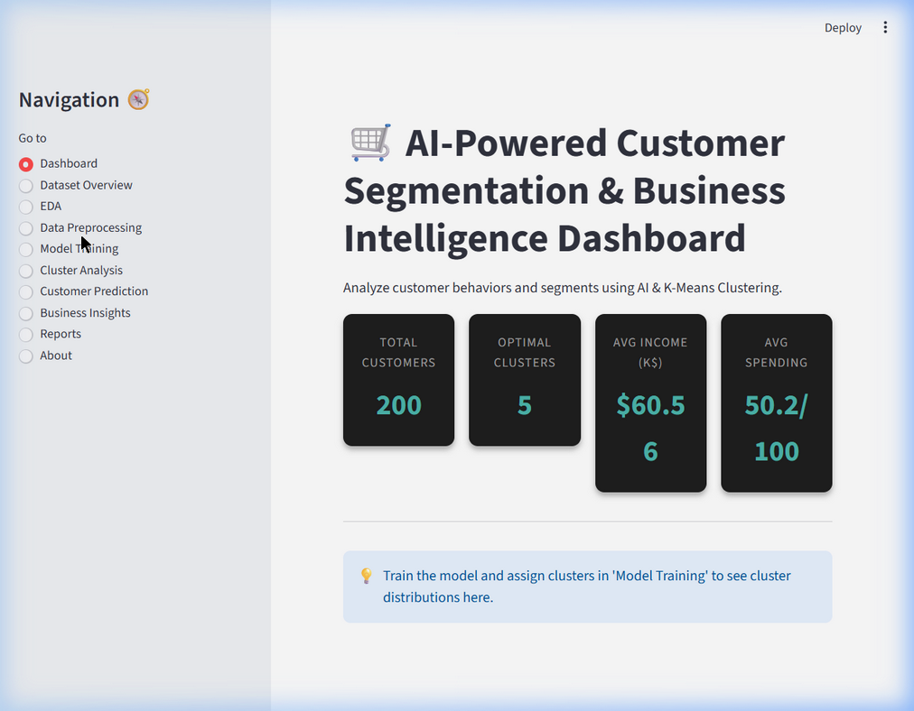
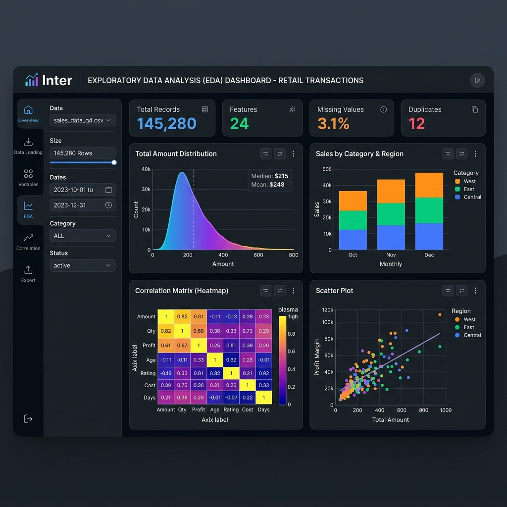
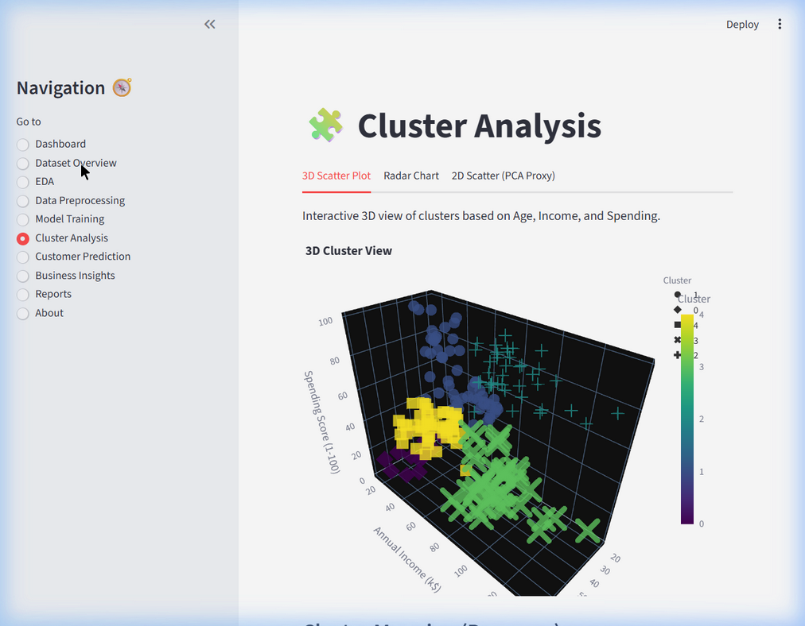

# AI-Powered Customer Segmentation & Business Intelligence Dashboard

This is a complete, production-quality Customer Segmentation project using K-Means clustering, built with Streamlit.

## Overview
This platform helps businesses understand customer behavior using Machine Learning by segmenting customers based on age, income, and spending score. It provides a comprehensive Business Intelligence dashboard for exploring data, training models, predicting new customer segments, and exporting actionable reports.

## Features
- **Dataset Overview:** Quick preview, summary statistics, missing values, and data structures.
- **Exploratory Data Analysis (EDA):** Interactive Plotly charts for distributions, pair plots, and correlation heatmaps.
- **Data Preprocessing:** Handles missing values, encodes features (like Gender), and scales numerical data automatically.
- **Model Training:** Determine the optimal number of clusters (K) using Elbow, Silhouette, and Davies-Bouldin scores. Train K-Means in one click.
- **Cluster Visualization:** Immersive 2D and 3D PCA Projections, plus Radar Charts outlining specific customer personas.
- **Customer Prediction:** Real-time persona classification for new customers entering the system.
- **Business Insights:** Data-driven, automated marketing strategies generated from cluster behavior.
- **Reports:** Export the analysis to downloadable PDF and CSV formats.

## Directory Structure
```
├── app.py                  # Main Streamlit application
├── requirements.txt        # Python dependencies
├── setup.py                # Script to download data and setup directories
├── test_backend.py         # Test script to verify ML pipeline logic
├── data/                   # Directory for dataset (Mall_Customers.csv)
├── models/                 # Saved models (KMeans, Scaler)
├── reports/                # Generated reports
├── assets/                 # Images, logos, etc.
└── utils/                  # Core modules
    ├── preprocessing.py    # Data cleaning and scaling
    ├── clustering.py       # K-Means training and evaluation
    ├── visualization.py    # Plotly interactive charts
    └── prediction.py       # Prediction and insights logic
```

## Installation Guide

1. **Clone the repository / Extract files**
2. **Create a virtual environment (Optional but recommended):**
   ```bash
   python -m venv venv
   source venv/bin/activate  # On Windows: venv\Scripts\activate
   ```
3. **Install Dependencies:**
   ```bash
   pip install -r requirements.txt
   ```
4. **Run Setup (downloads dataset):**
   ```bash
   python setup.py
   ```
5. **Run Application:**
   ```bash
   streamlit run app.py
   ```

## Screenshots
<div align="center">
  
  <br/>
  <i>Main Customer Segmentation Dashboard</i>
  <br/><br/>
  
  
  <br/>
  <i>Interactive Exploratory Data Analysis</i>
  <br/><br/>
  
  
  <br/>
  <i>3D Cluster Analysis and Persona Mapping</i>
</div>
